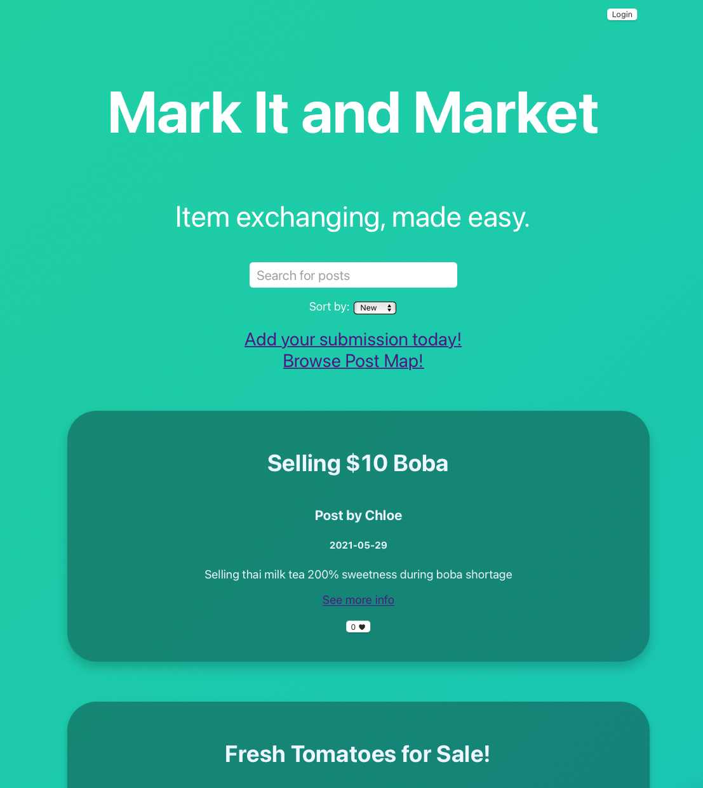
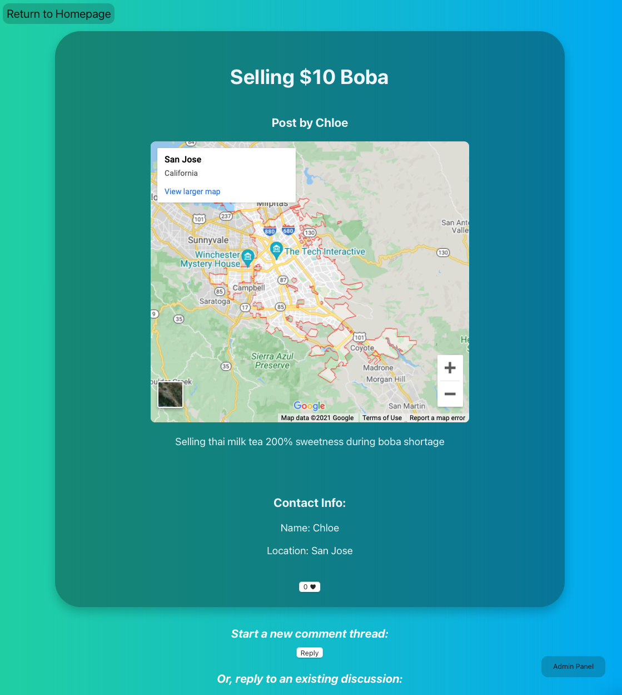
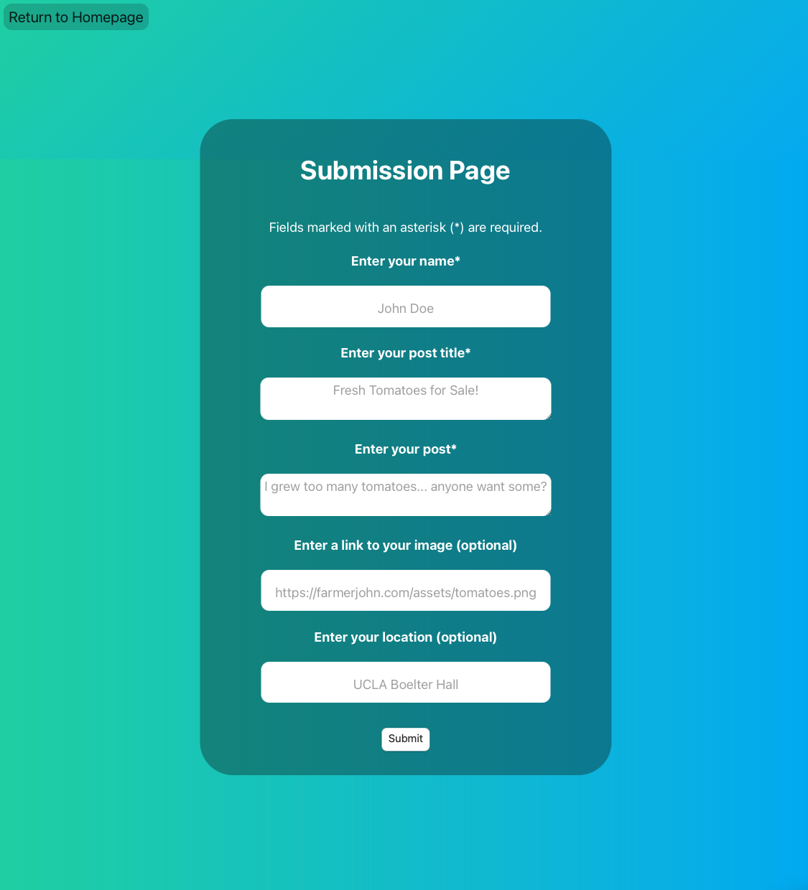
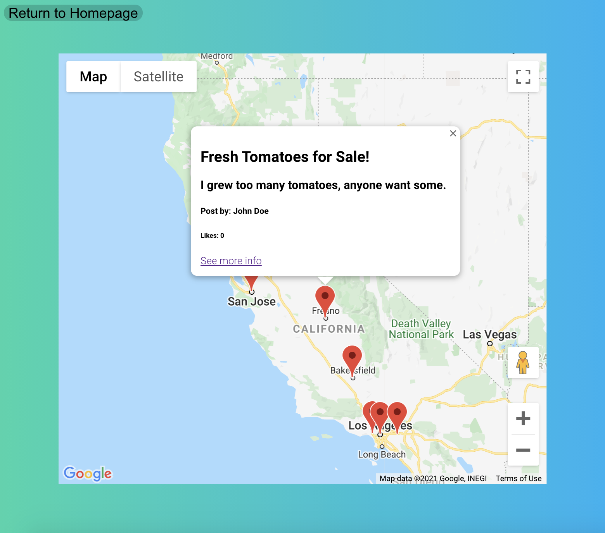

# Mark It and Market

UCLA CS 35L Project, Spring 2021, under the supervision of Professor Paul Eggert and our lovely TAs.

### Authors:
* Alan Yao
* Annie Liu
* Sumith Nalabolu
* Daniel Liu
* Jonathan Xu
* Leonard Chen

## About
Over time, farmers around the world have few means to advertise their produce to local customers around them, despite the proliferation of technology in the world around us. This project, a novel web application built using the [MERN Stack](https://bootcamp.berkeley.edu/resources/coding/learn-node-js/node-js-understanding-mern-stack/#:~:text=The%20MERN%20stack%20is%20comprised%20of%20four%20powerful,tandem.%20They%20are%3A%20MongoDB%3A%20An%20open-source%2C%20document-based%20database.), aims to alleviate this issue. We aim to connect local farmers with every-day people, so that customers can buy produce straight from farmers. This benefits farmers in that farmers are no longer forced to sell to produce conglomerate corporations, and instead can sell straight to the consumer. This results in increased profit margins for the farmer while allowing the consumer to enjoy farm-fresh produce.

## Screenshots
The Home Page:

A individual post's page:

The submission page to create a posting:

The page aggregating all posts, so that you can see which farmers are closest to you.


## Quick-start
1. Clone this repo by running `git clone https://github.com/ViciousCupcake/CS35L-Project.git`
2. Create the `.env` file with all of our secrets, and place it into `./backend/`
    * For more info on creating the environment file, see the [Environment Variables](#environment-variables) section
3. Install dependencies for the backend: `cd backend; npm install`
4. Install dependencies for the frontend: `cd frontend; npm install`
5. Start the backend: `cd ../backend; npm start`
6. Start the frontend: `cd ../frontend; npm start`
5. Visit the website at [localhost:3000](localhost:3000)


#### Misc Info:
* Backend by default is hosted at [localhost:8000](http://localhost:8000)
* Frontend by default is hosted at [localhost:3000](http://localhost:3000)

## Environment Variables
The environment variables should be stored into `./backend/.env`. This file should contain 8 entries:
| Environment Variable Name | Example                    | Description                                          | Where you can generate the key                                                          |
|---------------------------|----------------------------|------------------------------------------------------|-----------------------------------------------------------------------------------------|
| USERNAME                  | MongoUser1                 | The Username used by the backend to log into MongoDB | Follow the instructions at [https://docs.mongodb.com/guides/cloud/account/](https://docs.mongodb.com/guides/cloud/account/)                                                                 |
| PASSWORD                  | MongoPswd1                 | The Password used by the backend to log into MongoDB | Follow the instructions at [https://docs.mongodb.com/guides/cloud/account/](https://docs.mongodb.com/guides/cloud/account/)                                                                 |
| DB_LOCATION               | cluster5.abcde.mongodb.net | The address that your database is hosted at          |                Follow the instructions at [https://docs.mongodb.com/guides/cloud/account/](https://docs.mongodb.com/guides/cloud/account/)                                                                         |
| API_PORT                  | 8000                       | The port that the backend will be hosted on          | Choose a port number that doesn't conflict with an pre-existing process on your machine |
| GOOGLE_MAPS_API_KEY       | aBcDeFgH12345              | The API Key used for Google Maps                     | https://developers.google.com/maps/documentation/javascript/get-api-key                 |
| GOOGLE_CLIENT_ID          | fill in the blank          | fill in the blank                                    | fill in the blank                                                                       |
| GOOGLE_CLIENT_SECRET      | fill in the blank          | fill in the blank                                    | fill in the blank                                                                       |
| COOKIE_KEY                | fill in the blank          | fill in the blank                                    | fill in the blank                                                                       |


Put these 8 entries into `./backend/.env` in the format `ENVIRONMENT_VARIABLE=ENVIRONMENT_KEY`

For example,
```
USERNAME=MongoUser1
PASSWORD=MongoPswd1
DB_LOCATION=cluster5.abcde.mongodb.net
API_PORT=8000
GOOGLE_MAPS_API_KEY=aBcDeFgH12345
GOOGLE_CLIENT_ID=fill in the blank
GOOGLE_CLIENT_SECRET=fill in the blank
COOKIE_KEY=fill in the blank
```

## Git How-to Guide:
#### Cloning A Repo:
1. `cd` into the folder you want to clone (aka download) this repo to
2. Run the command `git clone https://github.com/ViciousCupcake/CS35L-Project.git` (Note that you will need git installed on your machine)

#### Adding Contributions:
1. Make a branch. To make a branch, run `git branch [NAME OF THE BRANCH]`
2. Type your code/contributions
3. Once your done, you want to `stage` your changes, by running `git add [FILES THAT YOU WANT TO ADD]`
4. Make a commit: `git commit -m [DESCRIPTION OF YOUR CHANGES]`
5. Push these changes to the server: `git push origin HEAD`
6. Go to [GitHub](https://github.com/ViciousCupcake/CS35L-Project) and open a Pull Request.
7. Wait for a code review, and if everything looks good, we'll see your contributions onto the main branch!

Thanks for the help!

#### Useful commands
* Add every file: `git add -A`
* Switch between branches: `git checkout [NAME OF THE BRANCH]`
* Get updates from the server: `git pull`
* List branches: `git branch`
* [For other commands, reference here](https://git-scm.com/doc)

## Special Thanks
* Nur Islam's [The MERN stack: A complete tutorial](https://blog.logrocket.com/mern-stack-tutorial/) (2020) is a well-written tutorial about getting started with the MERN Stack.
* Google's [Analytics Platform](https://analytics.google.com) provides useful tools on collecting real-time analytical data from your users.
* Google's [Maps Embed API Documentation](https://developers.google.com/maps/documentation/embed/get-started) provides guidence on how to efficiently get started with the Google Maps API.
* Jan Bodnar's [dotenv Tutorial](https://zetcode.com/javascript/dotenv/) (2020) is a brief tutorial going over what [dotenv](https://www.npmjs.com/package/dotenv) does and how you can use it in your own applications
* The OpenJS Foundation's [Node](https://nodejs.org/en/) is a useful JavaScript runtime that powers both the frontend and the backend of this project.
